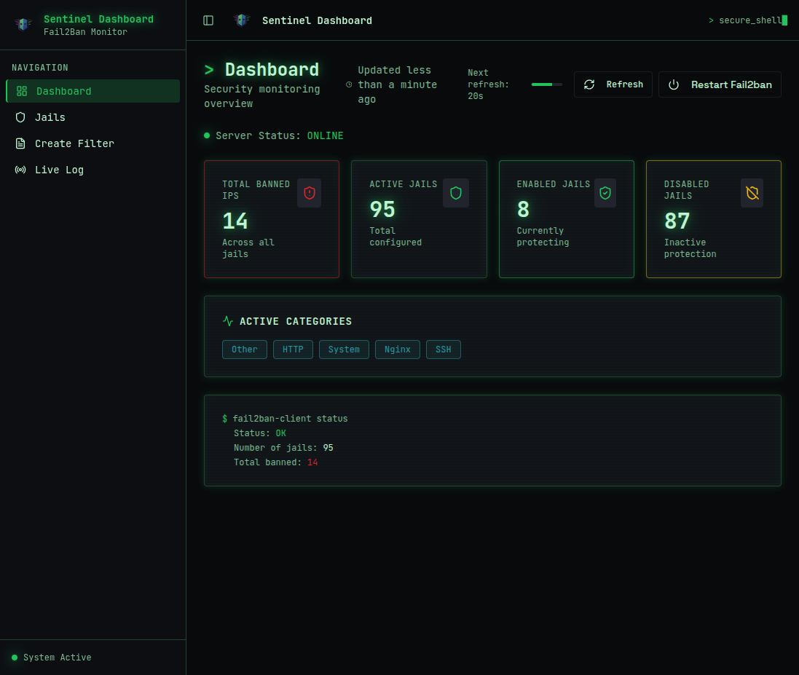

# Sentinel — The Missing Dashboard for Fail2ban

## Marketing Headline

**Stop managing fail2ban from the command line. Get real-time visibility into your security infrastructure with Sentinel.**

---

## Screenshots


*Real-time monitoring of all fail2ban jails, active bans, and security metrics*


*View and manage active bans, ban history, and IP addresses with one click*

---

## Key Features

- 🔴 **Live Fail2ban Dashboard** — Real-time monitoring of all jails
- 📊 **View Active & Historical Bans** — Complete ban history with filtering
- 🚫 **One-Click Unban** — Quickly unban IP addresses
- ⚙️ **Enable/Disable Jails** — Control fail2ban from the web UI
- 🔧 **Create Filters** — Build fail2ban filters through the interface
- 🔄 **Restart Fail2ban** — Service management with one click
- 📡 **WebSocket Live Logs** — Stream logs in real-time
- 🔐 **Production Ready** — JWT auth, rate limiting, Docker support

---

## GitHub Release Text

```markdown
# Sentinel Dashboard v2.0.0 — Production Release

## The Missing Dashboard for Fail2ban

Sentinel is a modern, production-ready web dashboard for monitoring and managing fail2ban. Stop SSH'ing into servers to check bans—get real-time visibility from your browser.

### What's New in v2.0.0

- ✅ Automated installer for Ubuntu/Debian
- ✅ Systemd services for production deployment
- ✅ Docker support with docker-compose
- ✅ JWT authentication with token rotation
- ✅ Rate limiting and brute force protection
- ✅ IP allowlist for additional security
- ✅ WebSocket authentication for secure log streaming

### Quick Install

```bash
curl -s https://raw.githubusercontent.com/Pepinko81/sentinel-view/main/install.sh | sudo bash
```

### Features

- Live fail2ban dashboard with real-time updates
- View active and historical bans
- One-click unban functionality
- Enable/disable jails from the UI
- Create and manage filters
- Restart fail2ban service
- WebSocket live log streaming

### Security

- JWT authentication with 1h token expiration
- Refresh tokens (7d) in HttpOnly cookies
- Rate limiting (5 login attempts / 10 min)
- Brute force protection with automatic lockout
- IP allowlist support

### Installation Options

**Option A: Automated Installer (Recommended)**
```bash
curl -s https://raw.githubusercontent.com/Pepinko81/sentinel-view/main/install.sh | sudo bash
```

**Option B: Docker**
```bash
cd docker && docker-compose up -d
```

### Documentation

- Full documentation: [README.md](README.md)
- Backend API: [backend/README.md](backend/README.md)
- Docker guide: [docker/README.md](docker/README.md)

### License

MIT License — Free and open source

---

**Built by [Pepinko](https://github.com/Pepinko81)**
```

---

## Reddit r/sysadmin Post

**Title:** I built a web dashboard for fail2ban — Sentinel v2.0.0

**Body:**

Hey r/sysadmin!

I've been managing fail2ban across multiple servers and got tired of SSH'ing in every time I needed to check bans or unban an IP. So I built **Sentinel** — a modern web dashboard for fail2ban.

**What it does:**
- Real-time monitoring of all jails and active bans
- View ban history with filtering
- One-click unban functionality
- Enable/disable jails from the UI
- Create and manage filters
- WebSocket live log streaming

**Why it's useful:**
- No more SSH access needed for routine tasks
- Real-time visibility into your security infrastructure
- Production-ready with JWT auth, rate limiting, Docker support
- One-command installation

**Quick install:**
```bash
curl -s https://raw.githubusercontent.com/Pepinko81/sentinel-view/main/install.sh | sudo bash
```

**Screenshots:**
- Dashboard: [overview.png](screenshots/overview.png)
- Ban management: [bans.png](screenshots/bans.png)

It's open source (MIT), and I'd love feedback from the community. What features would you find most useful?

GitHub: https://github.com/Pepinko81/sentinel-view

---

## ProductHunt Teaser

**Tagline:** The missing dashboard for fail2ban

**Description:**

Sentinel is a modern web dashboard that makes monitoring and managing fail2ban accessible, actionable, and secure.

**Key Features:**
- Real-time fail2ban monitoring
- One-click unban functionality
- Live log streaming
- Production-ready with Docker support
- JWT authentication and rate limiting

**Why it matters:**
Stop SSH'ing into servers to check bans. Get real-time visibility into your security infrastructure from your browser.

**One-command install:**
```bash
curl -s https://raw.githubusercontent.com/Pepinko81/sentinel-view/main/install.sh | sudo bash
```

Open source, MIT licensed, built for sysadmins and DevOps teams.

---

## Social Media Posts

**Twitter/X:**
🚀 Just released Sentinel v2.0.0 — the missing dashboard for fail2ban!

✅ Real-time monitoring
✅ One-click unban
✅ Live log streaming
✅ Production-ready

One-command install:
```bash
curl -s .../install.sh | sudo bash
```

Open source, MIT licensed.

#fail2ban #sysadmin #devops #opensource

**LinkedIn:**
I'm excited to share Sentinel v2.0.0 — a production-ready web dashboard for monitoring and managing fail2ban.

As someone who manages multiple servers, I found myself constantly SSH'ing in to check bans and manage fail2ban. Sentinel solves that by providing a modern, secure web interface.

Key features:
• Real-time monitoring of all jails
• One-click unban functionality
• Live log streaming via WebSocket
• Production-ready with Docker support
• Enterprise-grade security (JWT auth, rate limiting)

It's open source (MIT) and available now. Perfect for sysadmins, DevOps teams, and security professionals.

Try it: https://github.com/Pepinko81/sentinel-view

---

## Email Announcement

**Subject:** Introducing Sentinel v2.0.0 — The Missing Dashboard for Fail2ban

**Body:**

Hi [Name],

I'm excited to announce the release of **Sentinel v2.0.0** — a modern, production-ready web dashboard for monitoring and managing fail2ban.

**What is Sentinel?**

Sentinel provides a beautiful, real-time web interface for your fail2ban infrastructure. No more SSH access needed for routine tasks like checking bans or unbanning IPs.

**Key Features:**
- Real-time monitoring of all jails and active bans
- One-click unban functionality
- Live log streaming via WebSocket
- Production-ready with Docker support
- Enterprise-grade security

**Quick Start:**

```bash
curl -s https://raw.githubusercontent.com/Pepinko81/sentinel-view/main/install.sh | sudo bash
```

**Why I Built This:**

Managing fail2ban across multiple servers was becoming tedious. I needed a better way to monitor and manage my security infrastructure without constant SSH access.

**What's Next:**

This is v2.0.0 — production-ready and fully featured. I'm open to feedback and feature requests.

**Links:**
- GitHub: https://github.com/Pepinko81/sentinel-view
- Documentation: See README.md

Open source, MIT licensed, built for the community.

Best regards,
Pepinko

